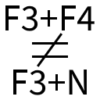

# Better Game Mode Switcher

This is a Fabric mod for Minecraft that makes <kbd>F3</kbd>+<kbd>N</kbd> and the game mode switcher (<kbd>F3</kbd>+<kbd>F4</kbd>) independent. It also enables <kbd>F3</kbd>+<kbd>N</kbd> and the game mode switcher even without operator permissions.

## Q&A

### Does this mean I will be able to change game mode even if I don't have the permission to?

No. The way the game determines if the game mode switcher should be enabled in vanilla is by checking if you have the right permission level (at least 2). But some servers might give you access to the `gamemode` command without also giving you the corresponding permission level. This causes the game mode switcher and <kbd>F3</kbd>+<kbd>N</kbd> to be disabled. Instead, this mod explicitly checks if the `gamemode` command is available.

### What does it mean exactly for <kbd>F3</kbd>+<kbd>N</kbd> and the game mode switcher to be independent?

Basically, the game mode switcher will never select Spectator by default. Instead, it selects your last non-Spectator game mode.

### Can I still switch to Spectator easily?

Yes, by using <kbd>F3</kbd>+<kbd>N</kbd> instead of the game mode switcher.

### Will it change my workflow?

Only if you commonly use the game mode switcher to switch between Spectator and another game mode. You will have to use <kbd>F3</kbd>+<kbd>N</kbd> for that.
